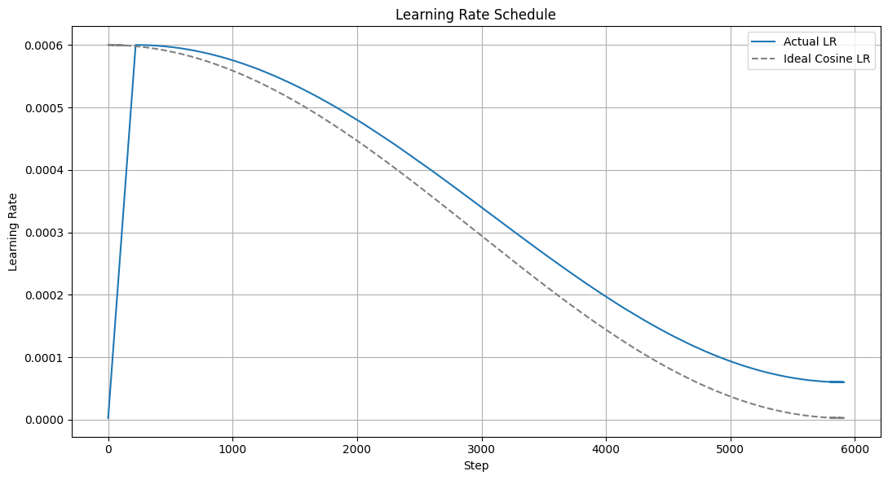
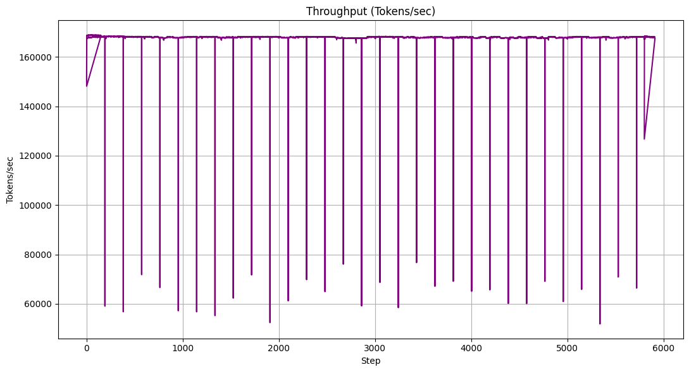
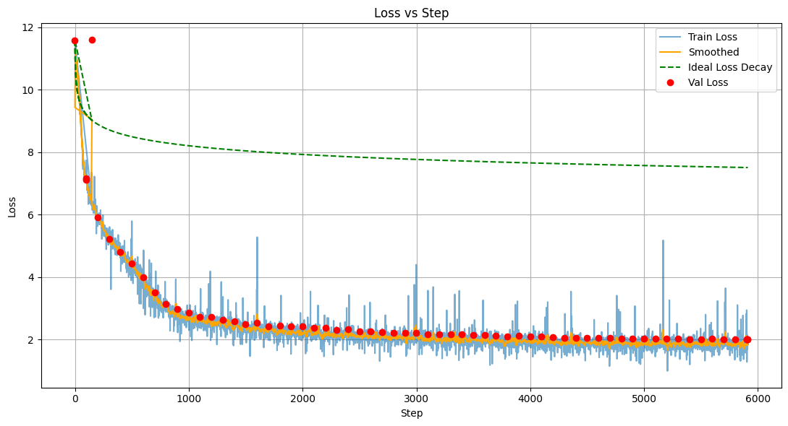
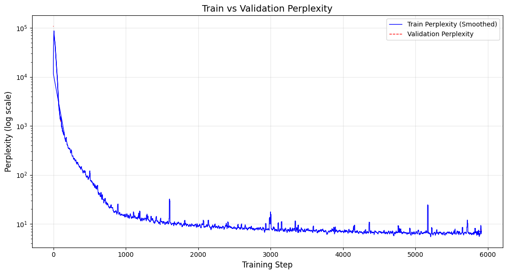

# CodeGPT-70M

A personal project to build and train a **70M-parameter GPT-style model from scratch** on Python code using the CodeParrot dataset. The goal is to implement and understand the full stack: architecture, pretraining, fine-tuning, evaluation, and inference.

---

## Overview

This project focuses on a **decoder-only, GPT-style transformer** implemented entirely in PyTorch, avoiding high-level libraries like Hugging Face Transformers for the core model code. It covers the entire machine learning pipeline for large language models, from data handling and model architecture to the training loop.

---

## Why 70M Parameters?

The **70 million parameter count** was chosen for its optimal balance of several practical considerations:
* **Reasonable Model Size:** Large enough for meaningful understanding, yet fitting for a personal project and minimal budget.
* **Resource Efficiency:** Specifically selected to fit within the 100-credit budget on Google Colab, leveraging the capabilities of an **A100 GPU**.
---

## Project Structure

├── originals_ipynb/       # Notebook experiments and prototypes  
├── dataloader.py          # Tokenization and dataset loading  
├── model.py               # Transformer architecture (decoder-only GPT)  
├── train.txt              # Training script  
├── requirement.txt        # Dependencies  
└── README.md

---

## Model Architecture

* **Decoder-only Transformer:** Follows the GPT architecture.
* **Parameters:** Approximately **69.8 million**.
* **Configuration Details:**
    * `n_embed` (Embedding Size): 448
    * `n_head` (Number of Attention Heads): 8
    * `n_layer` (Number of Transformer Layers): 10
    * `block_size` (Context Length): 1024
    * `vocab_size` (Vocabulary Size): 100,352
    * `dropout` (Dropout Probability): 0.1

---

## Dataset

* **Source:** **CodeParrot-clean**, a Python code dataset from Hugging Face.
* **Total Tokens:** The dataset comprises **3.4 billion tokens**, with 300 million tokens allocated for the validation split.
* **Tokenization:** Utilizes **byte-level BPE (Byte Pair Encoding)**.
* **Loading:** Handled efficiently using Hugging Face `Datasets`.
* **Preprocessing:** Implemented and managed within `dataloader.py`.

---

## Training

* **Framework:** PyTorch.
* **Optimizer:** **AdamW**
* **Learning Rate Scheduler:** **Cosine decay with warmup**
* 
* **Mixed Precision:** Optional support via `torch.cuda.amp`
* **Logging & Checkpointing:** Integrated for tracking progress and saving model states.
* **Simulated Batch Size:** 524,288 (2^19).

Here's the training throughput achieved on a single A100 GPU:

### Key Training Hyperparameters

* **Batch Size:** 16 (per device)
* **Max Sequence Length (`block_size` / Context Length):** 1024 tokens
* **Max Steps:** 5912 (corresponding to approximately 3.1 billion training tokens)
* **Warmup Steps:** 222 
* **Max Learning Rate:** 6e-4
* **Min Learning Rate:** 0.1 * `max_learning_rate`
* **Weight Decay:** 0.01

---

## Training Performance
The model was trained for 5,912 steps, showing a consistent decrease in both training and validation loss. The final validation perplexity achieved was **7.48**.

| Training & Validation Loss | Train vs. Validation Perplexity |
| :---: | :---: |
|  |  |

---

## Status

* [x] Model architecture
* [x] Dataset loading and tokenization
* [x] Training loop prototype
* [x] Full pretraining
* [ ] Evaluation and sampling
* [ ] Fine-tuning on specific Python tasks
* [ ] Inference UI
---
